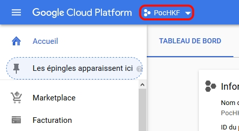

# Dialogflow-CMD

## Resume

It's a tool in command line who can import/export your Dialogflow's Agents, Intents, Entities.

## Commands

```
usage: main.py [-h] [-A] [-ia IMPORTAGENT | -ea] [-I | -E]
               [-i IMPORTMOD [IMPORTMOD ...] | -e EXPORTMOD [EXPORTMOD ...] |
               -r DELETEMOD [DELETEMOD ...]] -c CREDENTIALFILE [-l LANGUAGE]

Tool who can manage DialogFlow in command line

optional arguments:
  -h, --help            show this help message and exit
  -c CREDENTIALFILE, --credentialfile CREDENTIALFILE
                        Selects the file containing the DialogFlow
                        authentication information.
                        Expected admin service account file.
  -l LANGUAGE, --language LANGUAGE
                        Defined the language of the entity. By default : fr

Agent:
  -A, --agent           Manage an agent
  -ia IMPORTAGENT, --importAgent IMPORTAGENT
                        Import/Restore the selected agent.
                        ZIP file expected
  -ea, --exportAgent    Export agent to this folder :
                        "$data_export_folder/$ID_agent/Agents".
                        Expected name(s) of module(s)

Intention & Entité:
  -I, --intent          Manage an intent
  -E, --entity          Manage an entity
  -i IMPORTMOD [IMPORTMOD ...], --importModList IMPORTMOD [IMPORTMOD ...]
                        Import/Restore the selected module(s). Expected
                        JSON configuration file(s)
  -e EXPORTMOD [EXPORTMOD ...], --exportModList EXPORTMOD [EXPORTMOD ...]
                        Export the selected module(s).
                        Expected name(s) of module(s).
  -r DELETEMOD [DELETEMOD ...], --removeModList DELETEMOD [DELETEMOD ...]
                        Remove the selected module(s).
                        Expected name(s) of module(s).
```


## FAQ

### How to get my credentials ?

1. Create a DialogFlow Agent
2. Go to your [Google Cloud Dashboard](https://console.cloud.google.com/home/dashboard)
3. Select your project
   
4. On the left menu, click on "API Manager" > "Credentials"
5. Click on "Create credentials" > "Service Account Key"
   1. Create a new account key
   2. Name it
   3. Select roles : "Dialogflow" > "Administrator of the Dialogflow's API"
   4. File type of the key : JSON
   5. Click on create
6. Save the file where you want on your PC (DON'T LOSE IT)

**Hurray, you did it ! 👏**

### Some template for import intents/entities?

Yeah, there is in the folder `Templates`

But, really, go to the documentation to know how to construct your [Intents](https://dialogflow.com/docs/reference/api-v2/rest/Shared.Types/Intent) and [Entities](https://dialogflow.com/docs/reference/api-v2/rest/Shared.Types/BatchUpdateEntityTypesResponse#EntityType)

The best way to learn is still to analyze a file containing one of your entities or your intents that you have exported with this tool.

### This tool is in french ?!

Yeah, but you have all elements in this README for know how this tool work.
